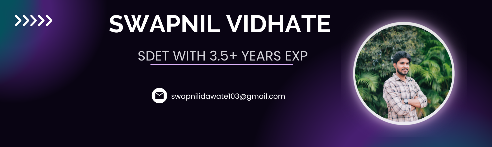

<h3 align="center">Hi there, I'm <a href="https://www.linkedin.com/in/swapnil-vidhate-025270151/" target="_blank" rel="noreferrer">Swapnil</a> 👋</h3>
<h2 align="center">I'm a Software Development Engineer in Test (SDET) with 3+ Years of Experience💻, Avid Gamer 👨‍💻, and Passionate Fitness Freak 🏋️‍♂️</h2>

## 🔭 Current Projects

- **Microservices Testing Automation Framework**
- **Single Automation Framework:** Integrating UI/API/Mobile automated tests
- **Postman Newman Automated Test**

## 🌱 Learning Goals

- **Cloud Technologies:** Exploring AWS services to enhance the automation testing process

## 🥇 Achievements

- **20% Improvement in Software Stability:** Implemented thorough manual testing strategies for better user experience across devices
- **30% Reduction in Testing Effort:** Worked with a team to optimize automation best practices, providing quick feedback for regression suites
- **40% Efficiency Increase:** Engineered automation scripts with Selenium and Java, significantly reducing manual testing time and increasing test coverage by 25%

## 💻 Featured Projects

## 💡 Skills

<h3 align="left">Languages and Tools:</h3>

  
  
  
  
  
  
  
  
  
  
  
  

## 📈 GitHub Stats

&nbsp;

## 📫 Contact

  I'm always open to new opportunities and collaborations. Feel free to reach out to me via email at <a href="mailto:swapnilidawate103@gmail.com">swapnilidawate103@gmail.com</a> or connect with me on <a href="https://www.linkedin.com/in/swapnil-vidhate-025270151/">LinkedIn</a>.

  
  

Thank you for visiting my portfolio! I look forward to discussing how I can contribute to your projects and initiatives.

